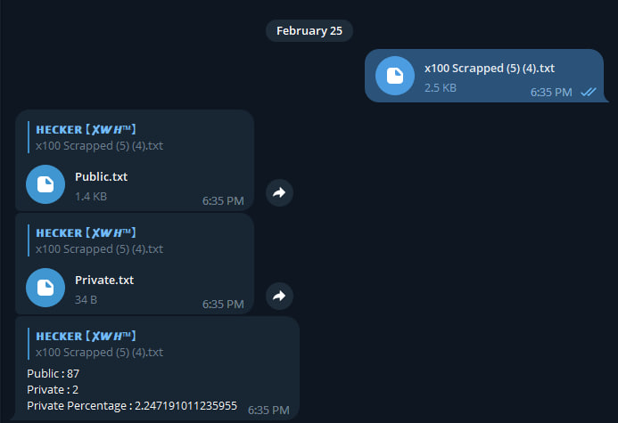

# AntiPublic-CC
A Telegram bot that verifies if your credit card is public via antipublic.cc api



SETUP : 
```
Q : How to run ? 
A : pip install pytelegrambotapi
A : change bot token on main.py , line 6 , in bot variable 
```
LIMITATIONS : 
> 100 CCs Only At Once

Reffer to the official [Api Docs](https://docs.antipublic.cc/) for more information
